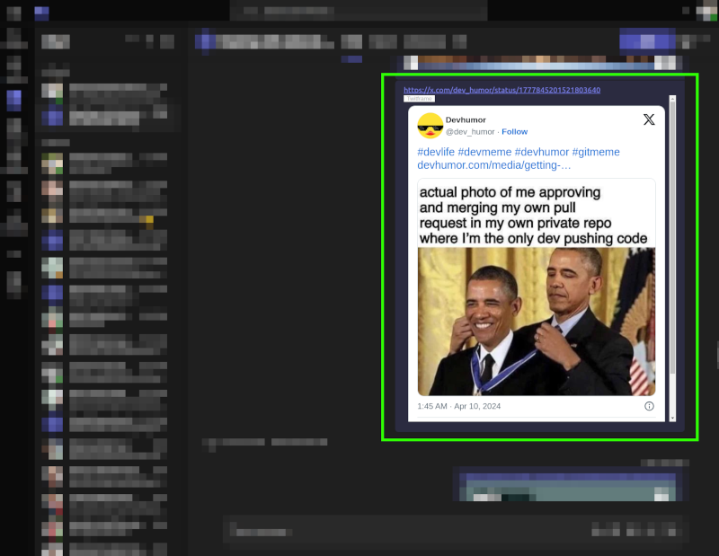

# Better Teams

Better Teams is a Chrome Extension that supercharges your Microsoft Teams experience! Whether you're sharing media, reacting to a call, or avoiding notification pop-ups, Better Teams has your back. Seamlessly embed media, improve usability, and enjoy a more polished Teams interface.

## 🌟 Features

### **Enhanced Call Reactions**: 
Move reaction buttons out of the popup menu and onto the call action bar. This helps you avoid the dreaded “Raise Hand” mistake when all you wanted to do was react with a 👍 or 👏.

**Reactions are now away from "raise hand"**:

---

### **Relocated Notifications**: 
Notifications are relocated so they won’t block any critical buttons or text fields, ensuring you always have a clear view of what matters.

---
\
\

### **Spotify Integration**:  

Share Spotify links, and Better Teams will embed a playable media player directly in your chat. No need to leave the conversation to jam to your favorite tunes!

Songs, playlists and artists links are supported.

**Sharing a song in a channel**:

**Sharing a playlist in a chat**:

---
\
\

### **YouTube & Shorts Integration**: 
Share YouTube videos or Shorts, and they’ll play right within the chat. No more navigating away from your conversation to watch videos.

**Sharing a Youtube video**:

**Sharing a Youtube Short**:

Also Youtube playlists links are supported.
---
\
\

### **X (Twitter) Embeds**: 
Instantly resolve tweets and display them with full media (images, videos) directly in your message feed.

**Sharing a tweet with an image**:

**Sharing a tweet with a video**:

---
\
\

### **Instagram posts**: 
Share Instagram posts and they’ll be displayed right in the chat. Also videos can be played withouth leaving the conversation.

**Sharing an Instagram post**:

---

## 🚀 Installation

1. Clone the repository to your local machine.
2. Open Google Chrome and navigate to `chrome://extensions/`.
3. Enable **Developer mode** by toggling the switch in the top-right corner.
4. Click the **Load unpacked** button and select the cloned repository folder.
5. That’s it! Better Teams is now installed and ready to enhance your Teams experience.

## 💡 Usage

1. Open Microsoft Teams in your Google Chrome browser.
2. Share or receive a YouTube video, tweet, or Spotify link in your Teams chat.
3. Better Teams will automatically detect the media and embed it directly in the conversation for a seamless experience.
4. In a call? Use the newly placed reaction buttons, far away from the "Raise Hand" button for easier, mistake-free reactions!

## 🛠️ Contribution & Issues

Have a feature request, feedback, or found a bug? Feel free to [open an issue](https://github.com/antorqs/better-teams/issues) or contribute via a pull request. Let’s make Microsoft Teams better, together!

## 📧 Contact

For any questions or suggestions, you can reach me at:

- Email: antorqs@gmail.com

## Thanks

Thanks to [Abel](https://github.com/atabel) for his help with hacking the reaction buttons ;)

Thanks to [Pablo](https://github.com/kydorn) for the relocation of the notifications ;)

Thank you for using Better Teams! I hope this extension enhances your Microsoft Teams experience in fun and useful ways.

## Acknowladges
Twitter integration is possible by using the service [TwitFrame](https://twitframe.com/)

Logos for this readme are provided by the awesome service [Logotypes.dev](https://logotypes.dev/)
